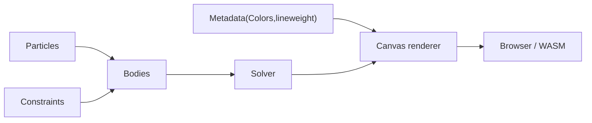
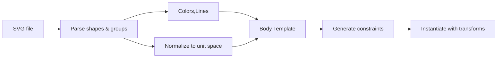

# Chubby Bunny

[](https://crates.io/crates/chubby_bunny_core)
[](https://crates.io/crates/chubby_bunny_svg)
[](https://crates.io/crates/chubby_bunny_canvas_renderer)
[](https://crates.io/crates/chubby_bunny_bindgen)

Chubby Bunny is a Rust workspace for WebAssembly-compatible soft-body physics.

 It lets you design polygonal shapes in a vector editor like Inkscape, feed them through an SVG pipeline that automatically builds hierarchical bodies and constraints, and run the simulation interactively in a browser.


> 🐰 **Live demo:** [chubby bunny example](http://weissenburger.info)

---

## Table of Contents

- [Why use this?](#why-use-this)
- [Design philosophy](#design-philosophy)
- [Available constraints](#available-constraints)
- [SVG pipeline](#svg-pipeline)
- [Examples](#examples)
- [Workspace crates](#workspace-crates)
- [Install from crates.io](#install-from-cratesio)
- [Getting started](#getting-started)
- [Project status](#project-status)

---

## Why use this?

| Feature | What it means for you |
|---|---|
| **SVG-to-body pipeline** | Draw shapes in Inkscape (or any SVG editor) and import them directly — no manual vertex wrangling |
| **Hierarchical body modeling** | Nest bodies inside other bodies to build complex characters from simple parts |
| **Automatic constraint generation** | The pipeline infers distance, area, and attachment constraints from your SVG structure |
| **WASM / browser-first** | The entire simulation runs in the browser via `wasm-bindgen` — no server required at runtime |
| **Tunable soft-body behavior** | Mix stiff and squishy parts by adjusting constraint stiffness on a per-body basis |

---

## Design philosophy

The system is organized around modular bodies arranged in a hierarchy. Constraints describe the relationships between those bodies, while forces act on them to drive motion and interaction. That separation keeps the model composable: bodies define the structure, constraints define how pieces relate, and forces influence the whole system externally.


---

## Available constraints

Constraints describe the physical properties of bodies. By adding them to a shape you can create stiff or squishy behavior. Constraints can be added manually or generated automatically by the SVG pipeline.


### Intrinsic constraints

These act within a single body.

- `DistanceConstraint`: preserves the distance between two particles
- `AreaConstraint`: preserves the signed area of a polygonal body
- `BendingConstraint`: preserves the turning angle at a polygon vertex

### Extrinsic constraints

These act between bodies or between a body and an external structure.

- `AttachmentConstraint`: connects child body particles to parent body particles
- `WallConstraint`: keeps bodies on one side of a parent-defined wall segment

### Collision constraints

Handles collision between bodies.

- `CollisionConstraint`: resolves edge intersections and containment contacts between sibling bodies

---

## SVG pipeline


The SVG pipeline is designed for polygonal shapes and nested group hierarchies.

Typical flow:

1. Parse an SVG into bodies with metadata.
2. Normalize the result into a unit-space template.
3. Optionally add automatic constraints for the parsed hierarchy.
4. Instantiate the template with transformations when needed.
5. 


---

## Examples
### Simple example
Create a struct to store the bodies and meta data, you want to display.
```
struct MinimalGame {
    bodies: Vec<Body>,
    meta_data: MetaMap,
}
```

Implement the required functions for the game trait
```rust
impl Game for MinimalGame {
    // called at the start
    fn init(&mut self, width: usize, height: usize) {
        self.bodies.clear();
        self.meta_data.clear();

        // lets build a simple quad, and add it to to the bodies we want to display
        let mut box_body = Body::empty();
        let mut create_particle_helper = |x, y| {
            box_body.particles.push(Particle::new(
                nalgebra::Vector2::new(x, y),     // position
                nalgebra::Vector2::new(0.0, 0.0), // initial velocity
                1.0,   // weight of this particle
                0.1,   // friction
                true,  // is it pinned currently
            ));
        };

        // CCW order
        create_particle_helper(0.25 * width as f32, 0.25 * height as f32);
        create_particle_helper(0.25 * width as f32, 0.75 * height as f32);
        create_particle_helper(0.75 * width as f32, 0.75 * height as f32);
        create_particle_helper(0.75 * width as f32, 0.25 * height as f32);
        self.meta_data.insert(box_body.id, default_meta(box_body.id, 1));
        self.bodies.push(box_body);
    }

    // called to reset the state e.g. when resizing
    fn reset(&mut self, width: f32, height: f32) {
        self.init(width as usize, height as usize);
    }

    // perform an update (physics step. handling events)
    fn update(&mut self, _incoming_events: VecDeque<Event>, dt_ms: f32) -> Vec<OutgoingEvent> {
        let settings = SolverSettings {
            reference_dt: 1.0 / 60.0,  // baseline for the expected speed
            constraint_iterations: 6,  // iterations for the physics
        };

        let dt = dt_ms / 1000.0;
        // add a force that acts as gravity. This c
        for body in self.bodies.iter_mut() {
            //let constant_force = chubby_bunny_core::force::constant_force(Vector2::new(0.0, 250.0)); //px/s^2
            //body.perform_step(&vec![constant_force], dt, &settings);
        }
        Vec::new() // we don't handle any events heere, so just return empty vec
    }

    // How the renderer acesses the actual data
    fn bodies_to_render(&self) -> &[Body] {
        &self.bodies
    }
    
    // How the renderer acesses the actual data
    fn meta_data_to_render(&self) -> &MetaMap {
        &self.meta_data
    }
}

/// This hooks up the WASM bindings for everything
#[chubby_bunny_bindgen]
pub struct MinimalBox(GameLoop<MinimalGame>);
```

### Available examples
The repository includes several WASM examples under `examples/`.

| Example | What it demonstrates |
|---|---|
| `minimal_box` | Minimal setup for a soft-body scene  |
| `constraint_example` | Side-by-side comparison of different constraint configurations |
| `interactive_example` | Interactive selection and dragging |
| `svg_example` | SVG-driven body generation from an imported file |

---

## Workspace crates

- `chubby_bunny_core`: physics primitives — particles, bodies, and constraints
- `chubby_bunny_svg`: SVG parsing, metadata extraction, and automatic constraint generation
- `chubby_bunny_canvas_renderer`: lightweight canvas rendering helpers
- `chubby_bunny_bindgen`: WASM-facing binding helpers
- `chubby_bunny_playground`: playground website featuring a lot of cute bunnies

---

## Install from crates.io

Chubby Bunny core crates are published and can be pulled directly from crates.io. Add the crates you need to your `Cargo.toml`:

```toml
[dependencies]
chubby_bunny_core = "0.1.0"
chubby_bunny_svg = "0.1.0"
chubby_bunny_canvas_renderer = "0.1.0"
# optional proc-macro helper
chubby_bunny_bindgen = "0.1.0"
```

Published crates:

- 📦 [chubby_bunny_core](https://crates.io/crates/chubby_bunny_core)
- 📦 [chubby_bunny_svg](https://crates.io/crates/chubby_bunny_svg)
- 📦 [chubby_bunny_canvas_renderer](https://crates.io/crates/chubby_bunny_canvas_renderer)
- 📦 [chubby_bunny_bindgen](https://crates.io/crates/chubby_bunny_bindgen)

---

## Getting started

The steps below are for working in this repository and running the local WASM demos.

### Prerequisites

- [Rust](https://rustup.rs/) (stable toolchain)
- [`wasm-bindgen-cli`](https://rustwasm.github.io/wasm-bindgen/) — installed automatically by the build scripts if not present
- Python 3 (for the local dev server or whatever you want to use)
- A wasm32 target: `rustup target add wasm32-unknown-unknown`

### 1. Build the Rust workspace

```sh
cargo build
```

### 2. Build all WASM examples at once

The root `build.sh` script builds every example and then starts a local server on port 8000:

```sh
./build.sh
```

To build a single example instead:

```sh
./examples/minimal_box/build.sh
```

### 3. Serve and open in the browser

If you used `./build.sh` the server is already running. Otherwise start it manually:

```sh
python3 -m http.server 8000
```

Then open an example page:

| Example | URL |
|---|---|
| `minimal_box` | <http://localhost:8000/examples/minimal_box/web/> |
| `constraint_example` | <http://localhost:8000/examples/constraint_example/web/> |
| `interactive_example` | <http://localhost:8000/examples/interactive_example/web/> |
| `svg_example` | <http://localhost:8000/examples/svg_example/web/> |

---

## Project status

Chubby Bunny is an active personal project and the API is still evolving. The core simulation, SVG pipeline, and browser demos are working and usable. Breaking changes between versions should be expected until a stable 1.0 is tagged.
